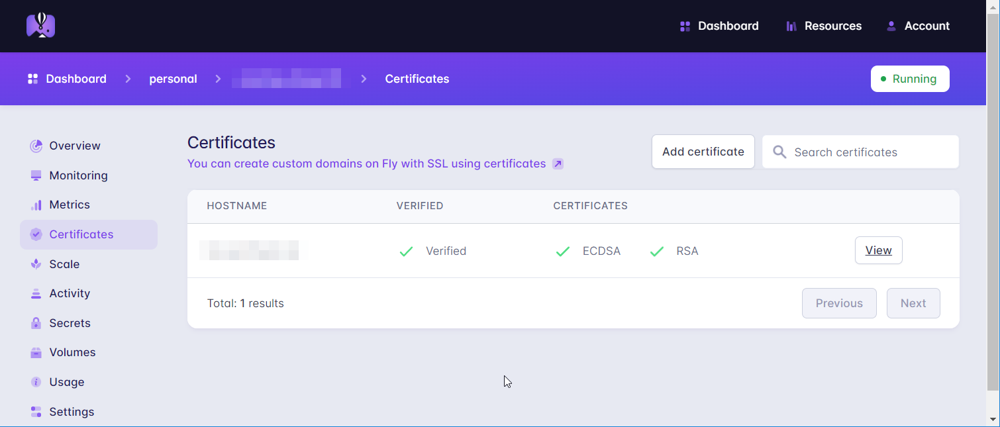

[Fly.io](http://Fly.io) 免费计划包含：

- 共3个单核256兆内存的应用和机器
- 共3GB的持久化卷
- 160GB出站数据
<!-- truncate -->
详情：https://fly.io/docs/about/pricing/#free-allowances

## 部署

注意：部署前请创建一个空文件夹，操作都在该文件夹内进行，生成的文件请妥善保存。

1. 安装 flyctl 并登录
    
    flyctl 用于操作 [Fly.io](http://Fly.io) 部署服务
    
    ```bash
    # macos 方式1
    $ brew install flyctl
    # macos 方式2
    $ curl -L https://fly.io/install.sh | sh
    # linux
    $ curl -L https://fly.io/install.sh | sh
    # windows
    $ powershell -Command "iwr https://fly.io/install.ps1 -useb | iex"
    
    # 登录
    $ flyctl auth signup
    ```
    
2. 创建 Dockerfile
    
    ```docker
    # Dockerfile
    FROM umputun/remark42
    ```
    
3. 部署
    
    执行: flyctl launch
    
    填写应用名，这个名称不能更改，并且 fly.io 会分配一个域名 	&lt;application-name&gt;.fly.dev，所以慎重，我推荐：<服务名称>-<个人名称>
    
    选择部署区域，推荐选日本，可以在这个网站测试 [liveview-counter.fly.dev](https://liveview-counter.fly.dev/) 你点加号看下边哪个地区数字有变化
    
    是否立即部署，否
    
    文件夹下会生成 fly.toml
    
    ```bash
    $ flyctl launch
    Update available 0.0.456 -> v0.0.458.
    Run "flyctl.exe version update" to upgrade.
    Creating app in remark42
    Scanning source code
    Detected a Dockerfile app
    ? Choose an app name (leave blank to generate one): remark42-alamiao
    automatically selected personal organization: alamiao
    ? Choose a region for deployment: Tokyo, Japan (nrt)
    Created app remark42-alamiao in organization personal
    Admin URL: https://fly.io/apps/remark42-alamiao
    Hostname: remark42-alamiao.fly.dev
    ? Would you like to set up a Postgresql database now? No
    ? Would you like to set up an Upstash Redis database now? No
    Wrote config file fly.toml
    ? Would you like to deploy now? No
    Your app is ready! Deploy with `flyctl deploy`
    ```
    
4. 设置 Docker 环境变量
    
    打开 fly.toml 在 env 下加入环境变量，参考 remark42 教程里给的 docker compose 环境变量
    
    ```bash
    [env]
      REMARK_URL = "https://remark42-alamiao.fly.dev"
      SECRET = "123456"
      TZ = "Asia/Shanghai"
    ```
    
5. 使用持久卷
    
    地区必须和上边的地区一样，flyctl regions list 可以看到
    
    注意：删除应用时会一并删除持久卷
    
    ```bash
    # flyctl vol create <卷名> -s <大小，单位GB> -r <地区>
    $ flyctl vol create remark42_data -s 1 -r nrt
    ```
    
    fly.toml 加入 mounts
    
    ```bash
    [env]
    ...
    
    [mounts]
      destination = "/srv/var"
      source = "remark42_data"
    ```
    
    最终配置是这样的
    
    ```bash
    # fly.toml file generated for remark42-alamiao on 2023-02-17T17:05:21+08:00
    
    app = "remark42-alamiao"
    kill_signal = "SIGINT"
    kill_timeout = 5
    processes = []
    
    [env]
      REMARK_URL = "https://remark42-alamiao.fly.dev"
      SECRET = "123456"
      TZ = "Asia/Shanghai"
    
    [mounts]
      destination = "/srv/var"
      source = "remark42_data"
      
    [experimental]
      auto_rollback = true
    
    [[services]]
      http_checks = []
      internal_port = 8080
      processes = ["app"]
      protocol = "tcp"
      script_checks = []
      [services.concurrency]
        hard_limit = 25
        soft_limit = 20
        type = "connections"
    
      [[services.ports]]
        force_https = true
        handlers = ["http"]
        port = 80
    
      [[services.ports]]
        handlers = ["tls", "http"]
        port = 443
    
      [[services.tcp_checks]]
        grace_period = "1s"
        interval = "15s"
        restart_limit = 0
        timeout = "2s"
    ```
    
6. 部署
    
    flyctl deploy
    
    等命令执行结束，去 [fly.io](http://fly.io) 的 dashboard 上就能看到了，访问地址: https://remark42-alamiao.fly.dev/web/ 
    
    到这步你能打开页面但是不能登录评论系统，篇幅有限 OAuth 相关的我没写，想看的话在下方留言，或者参考：[史上最全Remark42评论系统安装教程](https://matteo.eu.org/post/20230207014855.html)
    
7. 自定义域名（可选）
    
    dashboard 应用里左边选 Certificates，需要在域名解析下添加一条 txt 记录，txt 记录验证完删了就行
    



## Remark42 备份文件传输

[Restore Backup | Remark42](https://remark42.com/docs/backup/restore/)

```bash
# 进入应用内
$ flyctl ssh console
# 上传文件到 webdav，可以用坚果云或者自己搭建 cloudreve 之类的服务，我用的 seafile
$ curl --user <username>:<password> http://<webdav地址>/remark42/backup-remark-20230217.gz -T /srv/var/backup/backup-remark-20230217.gz
# 下载备份文件到 fly.io
$ curl --user <username>:<password> http://<webdav地址>/remark42/backup-remark-20230217.gz > backup-remark-20230217.gz

# 还原前需要设置环境变量 ADMIN_PASSWD
$ restore -f /backup-remark-20230217.gz -s remark
$ rm -rf backup-remark-20230217.gz
```